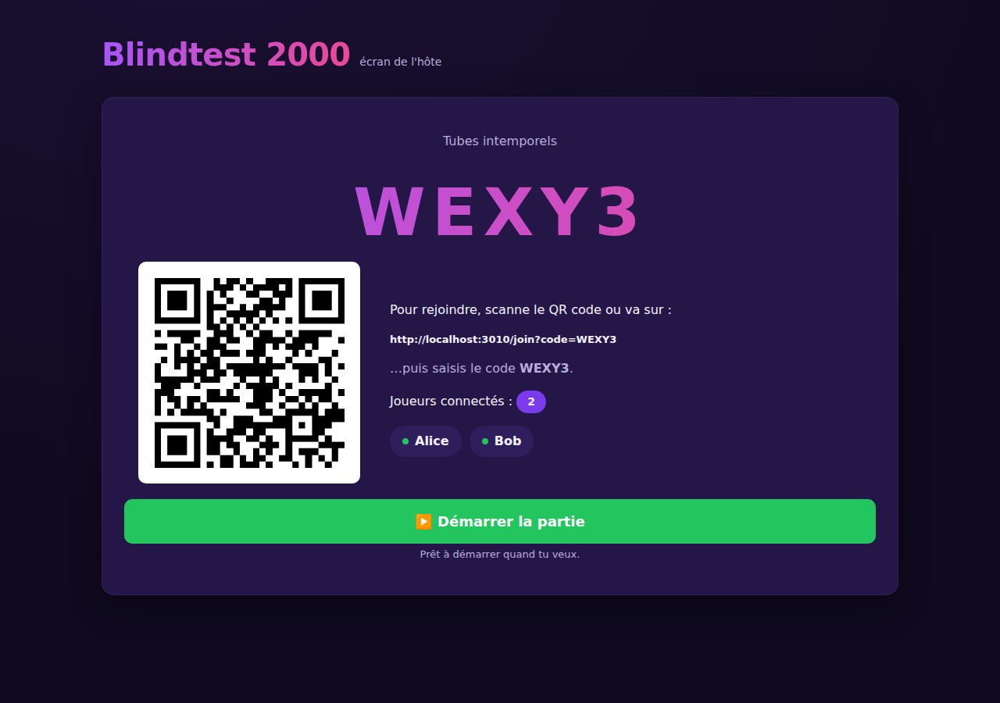

# 🎵 Blindtest 2000

Application web de blindtest musical façon **Kahoot** : l'hôte lance une partie sur
son écran, les joueurs rejoignent depuis leur téléphone en scannant un QR code (ou
en tapant un code), et répondent à un QCM pour chaque extrait joué.

Cette version est une **première version jouable, déployable et testable de bout en
bout** — voir [Périmètre de cette v1](#-périmètre-de-cette-v1) pour ce qui est
inclus et ce qui viendra ensuite.



---

## ✨ Ce que fait l'application

- **Hôte** (grand écran) : choisit un quiz, ouvre une salle (**code + QR code**),
  lance chaque manche à son rythme, l'extrait est joué via le lecteur YouTube
  embarqué sur son écran, puis la réponse est révélée avec le classement.
- **Écran public à projeter / partager** : un second écran (bouton **🖥️ Écran
  public**) affiche le code, le QR, le minuteur, la question, les propositions et
  le classement — **mais jamais la vidéo YouTube**. L'hôte garde sa fenêtre de
  contrôle (avec la vidéo) sur son écran privé et projette / partage l'écran
  public, pour ne **pas dévoiler le morceau** avant la réponse. Les deux fenêtres
  se synchronisent en direct (même navigateur, via `BroadcastChannel`).
- **Joueurs** (mobile) : rejoignent avec un code + un pseudo, répondent au QCM (le
  premier tap verrouille la réponse), voient s'ils ont eu bon/faux, les points
  gagnés et leur place au classement.
- **Mode Individuel ou Équipes** (au choix de l'hôte) : en mode équipes, chaque
  joueur est sur **son propre téléphone** mais rattaché à une équipe (rejointe ou
  créée à la volée). L'équipe **vote ensemble** (tally en direct, vote modifiable) ;
  **un membre verrouille** la réponse quand l'équipe est d'accord (la plus votée).
  Si le timer se termine sans verrouillage, la **plus votée** est retenue
  (départage : la première option votée). Score **commun** ; classement/podium par équipe.
- **Scoring serveur infalsifiable** : les points (base + bonus de vitesse) sont
  calculés **uniquement à partir d'horodatages serveur** — aucune valeur envoyée
  par le client n'est utilisée.
- **Salles isolées** : plusieurs parties tournent en parallèle sans jamais se voir.
- **Nombre de joueurs illimité** : aucune limite artificielle.
- **Reconnexion** : recharger la page ou perdre le réseau ne fait pas perdre son
  score ni sa place.
- **Quiz de démonstration** livrés d'origine + **création, édition et
  suppression** de ses propres playlists depuis l'interface.
- **Bonus de série (combo)** : points bonus croissants pour les bonnes réponses
  consécutives (+100 par palier, plafonné à +500), **activable/désactivable par
  l'hôte** à l'ouverture de la salle.
- **Contrôles hôte** pendant la partie : **rejouer** l'extrait, **pause/reprise**
  (chrono gelé équitablement), **passer** une manche (sans la noter), et
  **exclure** un joueur depuis le lobby.
- **Récap de fin de manche** : répartition des votes par proposition (façon
  Kahoot) et nombre de joueurs ayant trouvé.
- **Minuteur visible** côté hôte **et** côté joueur (compte à rebours + barre).

---

## 🚀 Lancer en local (le plus simple)

Prérequis : **Node.js ≥ 20** (testé sur Node 22).

```bash
npm install
npm start
```

Puis ouvre :

- **Écran de l'hôte** : <http://localhost:3000>
- **Écran joueur** : <http://localhost:3000/join> (ou scanne le QR affiché par l'hôte)

Pour tester seul sur une seule machine : ouvre l'hôte dans un onglet, crée une
salle, puis ouvre `/join` dans un autre onglet (ou sur ton téléphone connecté au
même réseau, via l'URL affichée).

En développement avec rechargement automatique : `npm run dev`.

---

## ☁️ Déployer sur Render (un seul service)

Le dépôt contient un **`render.yaml`** (Blueprint) prêt à l'emploi.

1. Pousse ce dépôt sur GitHub (déjà le cas).
2. Sur [Render](https://render.com) : **New ➜ Blueprint**, sélectionne ce dépôt et
   la branche. Render lit `render.yaml` et crée un service web gratuit.
3. Render exécute `npm ci` puis `npm start`, et surveille `/api/health`.
4. Une fois déployé, l'URL publique de Render sert **à la fois** l'écran hôte et
   l'écran joueur. Le QR code utilise automatiquement `RENDER_EXTERNAL_URL`, donc
   les joueurs peuvent scanner et rejoindre depuis n'importe où.

> Alternative Docker : un `Dockerfile` autonome est fourni. Pour l'utiliser sur
> Render, remplace `runtime: node` par `runtime: docker` dans `render.yaml`, ou
> lance localement `docker build -t blindtest . && docker run -p 3000:3000 blindtest`.

Aucune base de données ni service externe n'est nécessaire pour cette v1.

---

## 🔐 Accès hôte (login)

L'écran de l'hôte est protégé par un **login + mot de passe** (compte `admin`).
Les joueurs, eux, rejoignent **sans compte**. Configure via variables d'env :

| Variable | Rôle | Défaut |
|---|---|---|
| `ADMIN_USERNAME` | Identifiant de l'hôte | `admin` |
| `ADMIN_PASSWORD` | Mot de passe de l'hôte (haché avec scrypt) | `admin` ⚠️ à changer |
| `SESSION_SECRET` | Secret de signature des sessions (cookie) | aléatoire par démarrage |

> Sur Render : **Environment** → ajoute `ADMIN_PASSWORD` et `SESSION_SECRET`
> (chaîne aléatoire longue et stable, sinon tu es déconnecté à chaque
> redéploiement). Le compte admin est (ré)appliqué à chaque démarrage, donc
> changer `ADMIN_PASSWORD` puis redéployer met à jour le mot de passe. Les
> playlists que tu crées sont **rattachées à ton compte** ; les démos restent
> visibles par tous.

## 🧪 Tests

Pyramide de tests (rapide, sans dépendance externe) :

```bash
npm test          # unitaires (scoring, codes, YouTube, moteur de salle) + intégration (flux Socket.IO complet)
npm run typecheck # vérification TypeScript
```

- **Unitaires** : logique de scoring, génération de codes non ambigus, parsing des
  liens YouTube, moteur de partie (lobby, verrouillage au 1er tap, scoring
  cumulé, reconnexion, isolation des salles).
- **Intégration** : une partie complète jouée via de vrais clients Socket.IO
  (création de salle, arrivée de 2 joueurs, réponses, scoring serveur, classement,
  isolation de deux salles simultanées), l'authentification hôte et le CRUD des
  playlists (HTTP).
- **Charge** : `src/load.test.ts` fait jouer **40 joueurs simultanés** sur une
  manche complète et vérifie le classement.

### Test de charge sur une instance en ligne

Un script autonome simule N joueurs sur n'importe quelle URL (local ou Render) :

```bash
node scripts/loadtest.mjs http://localhost:3000 40
node scripts/loadtest.mjs https://blindtest-2000.onrender.com 50
# Identifiants hôte via ADMIN_USERNAME / ADMIN_PASSWORD (défaut admin/admin)
```

Il ouvre une salle, y connecte N joueurs, joue une manche et affiche les
latences (min / moyenne / p95 / max) et le temps total.

---

## 🧭 Périmètre de cette v1

Cette version vise **la boucle de jeu complète, déployable et testable tout de
suite**. Choix assumés pour y arriver vite et de façon fiable :

| Sujet | Choix v1 | Évolution prévue |
|---|---|---|
| **Lecture des extraits** | Lecteur **YouTube embarqué** sur l'écran de l'hôte (seek + play sur l'extrait). Pas d'extraction de fichier audio. | Extraction serveur (yt-dlp/ffmpeg) + stockage R2, en secours l'upload manuel — comme prévu dans les specs. |
| **Stockage** | Playlists **persistées dans PostgreSQL** si `DATABASE_URL` est défini (sinon en mémoire). L'état des parties en cours reste en mémoire (une partie est éphémère). | Idem + comptes hôte ; migrations Drizzle. |
| **Comptes hôte** | **Login + mot de passe** (compte `admin` unique via variables d'env), sessions par cookie signé ; les playlists sont **rattachées à l'utilisateur**. | Plusieurs comptes / inscription ; migration vers `better-auth`. |
| **Serveur** | Node + Express + Socket.IO, un seul service. | Fastify + adaptateur Redis Socket.IO pour le multi-instances. |

> 💾 **Persistance des playlists** : définis `DATABASE_URL` (PostgreSQL — p. ex.
> [Neon](https://neon.tech), gratuit) et les playlists créées sont conservées
> entre les redémarrages/redéploiements. Sans `DATABASE_URL`, le stockage est en
> mémoire (les quiz créés sont réinitialisés au redémarrage ; les 2 démos
> reviennent toujours). Si `DATABASE_URL` est défini mais la base est injoignable,
> l'app bascule automatiquement en mémoire et reste en ligne (message dans les logs).
> Dans tous les cas, une partie **en cours** vit en mémoire (c'est voulu : une
> partie est éphémère).

Le lecteur YouTube nécessite un accès à YouTube depuis le **navigateur de l'hôte**
(donc une connexion internet côté hôte). Si une vidéo est indisponible, la manche
se joue quand même : le QCM et le scoring fonctionnent, seule la lecture de
l'extrait est absente.

Les documents de conception complets restent dans `openspec/` (contrat de specs) et
`.planning/` (boucle d'implémentation GSD).

---

## 🗂️ Structure

```
src/
  index.ts              # point d'entrée (écoute HTTP)
  server.ts             # Express + Socket.IO, routes API, câblage des évènements
  types.ts              # contrat de types (manches, salles, classement…)
  validation.ts         # schémas zod pour toute entrée non fiable (joueurs/hôte)
  game/
    room.ts             # moteur de salle (état de partie, réponses, scoring, isolation)
    scoring.ts          # calcul des points serveur-autoritaire + classement
    codes.ts            # codes de salle courts non ambigus (nanoid)
    quizzes.ts          # quiz de démonstration
    store.ts            # stockage en mémoire des quiz
    youtube.ts          # extraction de l'ID vidéo depuis une URL/ID
  *.test.ts             # tests unitaires + intégration (vitest)
public/
  index.html            # écran hôte (contrôle + vidéo)   join.html  # écran joueur (mobile)
  present.html          # écran public à projeter/partager (sans vidéo)
  css/styles.css        # thème + composants
  js/host.js  js/player.js  js/present.js  js/common.js
Dockerfile  render.yaml  # déploiement
```

---

## 🎮 Déroulé d'une partie

1. L'hôte ouvre <http://localhost:3000>, choisit un quiz, clique **Ouvrir une salle**.
   Pour projeter sans dévoiler la vidéo : bouton **🖥️ Écran public** (nouvelle
   fenêtre `/present`) → mets **celle-ci** sur le vidéoprojecteur / en partage
   d'écran, et garde la fenêtre de contrôle (avec la vidéo) sur ton écran privé.
2. Les joueurs scannent le QR (ou vont sur `/join` et tapent le code) + un pseudo.
3. L'hôte clique **Démarrer la partie** ; à chaque manche l'extrait joue sur son
   écran, les joueurs voient le QCM et répondent (1er tap = verrouillé).
4. L'hôte **révèle** (ou le minuteur de la manche s'en charge) : chacun voit son
   résultat et le classement se met à jour.
5. **Manche suivante** jusqu'à la fin, puis **classement final**.
